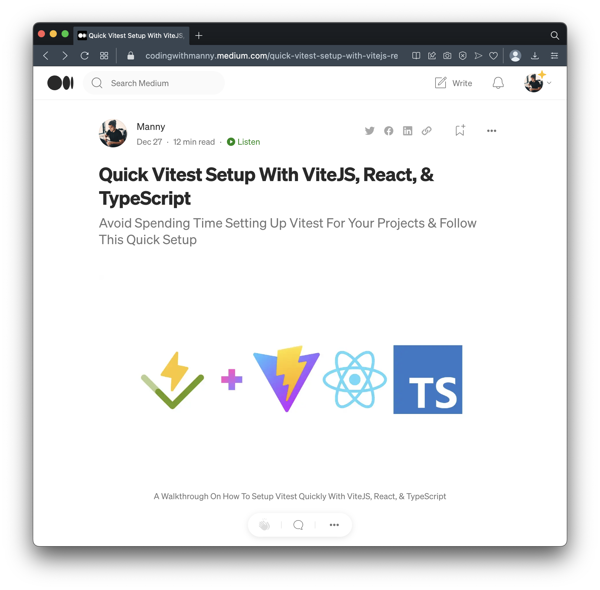

# Quick ViteJS React TypeScript Vitest

This is a quick base code for setting up [Vitest](https://vitest.dev) tests for our ViteJS project for React and TypeScript.

**NOTE:** This scaffolded project is based on [ViteJS React TypeScript Template](https://github.com/vitejs/vite/tree/main/packages/create-vite/template-react-ts).

This code is based on the article [Quick Vitest Setup With ViteJS, React, & TypeScript](https://codingwithmanny.medium.com/quick-vitest-setup-with-vitejs-react-typescript-bea9d3a01b07).



## Requirements

- Node `v18.12.1`
- PNPM `v7.15.0`

## Setup

Install dependencies:

```bash
# FROM ./

pnpm install;
```

Run tests:

```bash
# FROM ./

pnpm test;
```

## Tests

There are the main file used for testing.

Main test file:
- `src/__tests__/App.test.jsx`

Main vite config file
- `vite.config.ts`

Main vitest setup file to extend jest
- `vitest.setup.ts`
